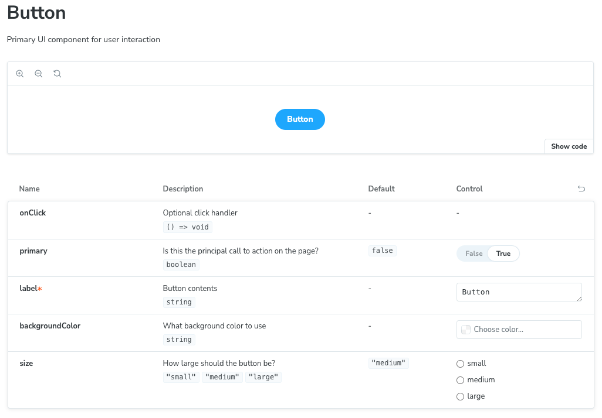
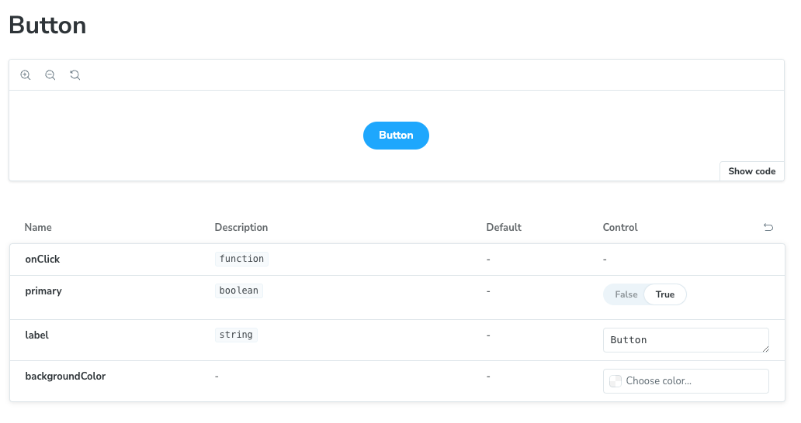

# Storybook 8.4.6+ react-docgen-typescript bug

When initializing a brand new storybook with versions 8.4.6 and above and using react-docgen-typpescript the autogenerated documentation fails to pick up JSDocs entirely.

# What I expect to see (v8.4.5 and below display like this)

# What I actually see

